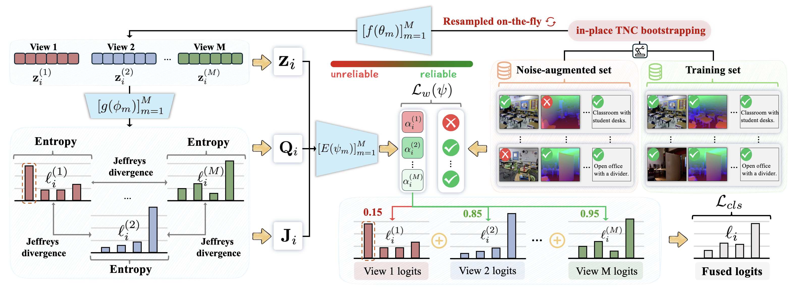

# 🚀 2026-CVPR-BML

<p align="center">
  <b>[CVPR 2026] Official PyTorch implementation of</b><br/>
  <i>Bootstrapping Multi-view Learning for Test-time Noisy Correspondence</i>
</p>

<p align="center">
  <a href="https://cvpr.thecvf.com/Conferences/2026"></a>
  <a href="https://drive.google.com/drive/folders/1PWqNc6Op9NPg6tWXzyoMbJlaWL-Dvnuo?usp=sharing"></a>
  <a href="https://huggingface.co/datasets/changhaohe/SUN-R-D-T"></a>
  
</p>

---

## ✨ Overview

This repository provides the official code for BML under two practical settings:

- **Multi-view classification** on feature-based `.mat` datasets
- **Multi-modal scene classification** on **SUN-R-D-T** (RGB / Depth / Text)

BML is designed for **test-time noisy correspondence**, where cross-view/modal alignment can be corrupted at inference time.



---

## 📦 Data Preparation

### 1) Multi-view datasets

Download link: [📚 Google Drive](https://drive.google.com/drive/folders/1PWqNc6Op9NPg6tWXzyoMbJlaWL-Dvnuo?usp=sharing)

Place all `.mat` files under:

```text
datasets/multi-view-datasets/
  100Leaves.mat
  3V_Fashion_MV.mat
  AwAfea.mat
  Caltech-5V.mat
  CCV.mat
  handwritten.mat
  LandUse_21.mat
  NUSWIDEOBJ.mat
  Scene15.mat
  YoutubeFace_sel.mat
```

#### Add your own multi-view dataset

To plug in a custom dataset, update `load_multiviewdata(...)` in `multi_view.py`.

Minimal template inside `load_multiviewdata`:

```python
elif args.dataset_name == 'YourDatasetName':
    mat = sio.loadmat(args.dataset_path + args.dataset_name + '.mat')
    data_list.append(mat['X1'])   # [N, D1]
    data_list.append(mat['X2'])   # [N, D2]
    # ... add more views if needed
    labels = np.squeeze(mat['Y']).astype(np.int64)  # [N]
```


### 2) SUN-R-D-T dataset

Download link: [🤗 Hugging Face](https://huggingface.co/datasets/changhaohe/SUN-R-D-T)

Expected structure:

```text
datasets/SUN-R-D-T/
  train.json
  test.json
  train/
  test/
  cache/
```

> A cache will be auto-generated at `datasets/SUN-R-D-T/cache/` for on-the-fly augmentation.

### 3) Pretrained weights

| Name | Path | Link |
| --- | --- | --- |
| ResNet18 | `weights/resnet/checkpoints/` | [ Link](https://download.pytorch.org/models/resnet18-f37072fd.pth) |
| BERT-base-uncased | `weights/google-bert/bert-base-uncased/` | [🤗 Link](https://huggingface.co/google-bert/bert-base-uncased) |

---

## 🏃 Quick Start


### Multi-view experiments

```bash
python multi_view.py --dataset_name Scene15 --seeds 0 1 2 3 4 5 6 7 8 9
```

### SUN-R-D-T experiments (RGB / Depth / Text)

```bash
python multi_modal.py --dataset_name SUN-R-D-T --seeds 0 1 2 3 4
```

---

## 📊 Output

The evaluation table reports performance from noise ratio `0.0` to `1.0` (step `0.1`) for each seed, then aggregates with **MEAN** and **STD**.

- Column `0.0`: vanilla multi-view/modal classification (no test-time noisy correspondence)
- Columns `0.1` ~ `1.0`: robustness under increasing noisy correspondence

Example:

```text
============================================================================================================
                                       Scene15 evaluated complete. ✅                                        
============================================================================================================
  Seed  |  0.0   |  0.1   |  0.2   |  0.3   |  0.4   |  0.5   |  0.6   |  0.7   |  0.8   |  0.9   |  1.0   |
------------------------------------------------------------------------------------------------------------
  ...
------------------------------------------------------------------------------------------------------------
  MEAN  | 83.92  | 82.90  | 81.95  | 80.78  | 79.63  | 79.25  | 77.68  | 76.33  | 75.42  | 74.41  | 74.04  |
  STD   |  1.39  |  1.42  |  1.34  |  1.18  |  1.64  |  1.53  |  1.34  |  1.61  |  1.06  |  1.94  |  1.10  |
============================================================================================================

```

> Logs are saved to: `logs/<dataset_name>/<timestamp>/train.log`

---

## 📝 Citation

If you find BML useful, please consider citing our papers 📝 and starring us ⭐️！

```bibtex
@InProceedings{BML,
    author    = {He, Changhao and Xue, Di and Li, Shuxian and Hao, Yanji and Peng, Xi and Hu, Peng},
    title     = {Bootstrapping Multi-view Learning for Test-time Noisy Correspondence},
    booktitle = {Proceedings of the Computer Vision and Pattern Recognition Conference (CVPR)},
    month     = {June},
    year      = {2026},
}
```